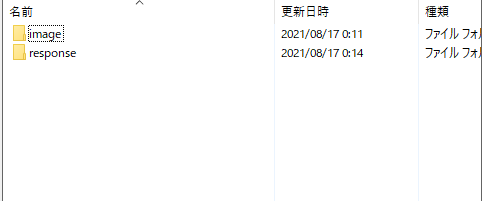
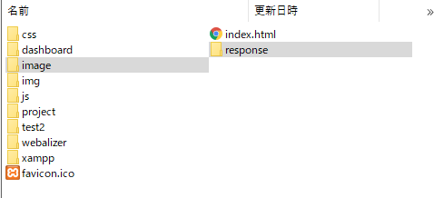
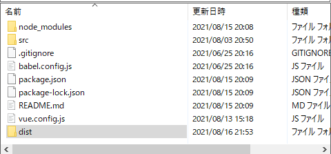
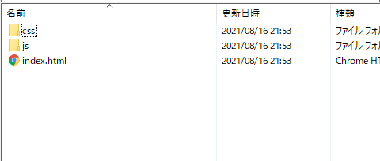
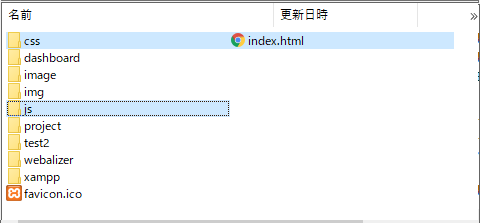
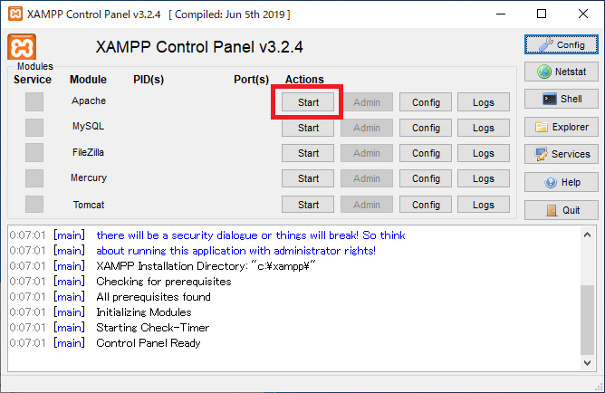
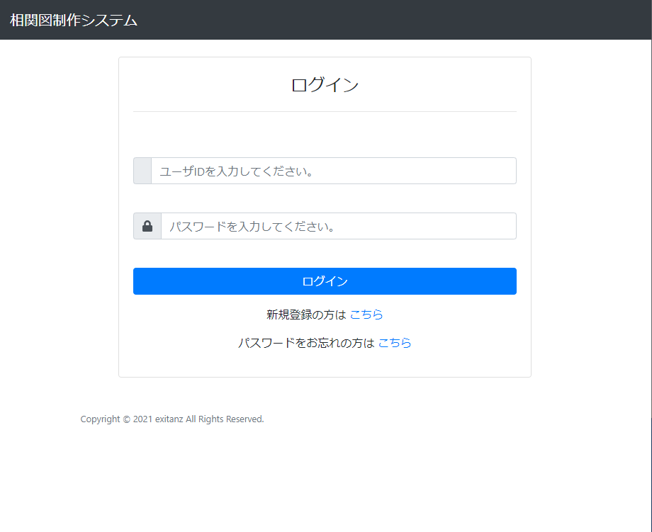

# 今後の開発について

## 1．初期配置


1.  `初期配置 ディレクトリ` を開く

2. `xampp\htdocs`　直下に `初期配置 ディレクトリ` の中身を置く

## 2．画面の確認

1. 画面作成後、以下コマンド実行
```
npm run build
```


2. dist ディレクトリの生成を確認（もともとあれば勝手に作り直す）

3. `xampp\htdocs`　直下に `dist ディレクトリ` の中身を置く

4. XAMPP `Apache` を起動

5. `http://localhost/`　にアクセスする