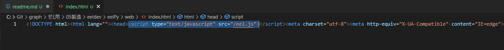
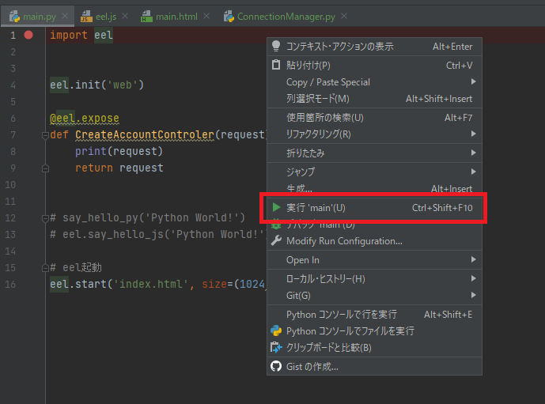
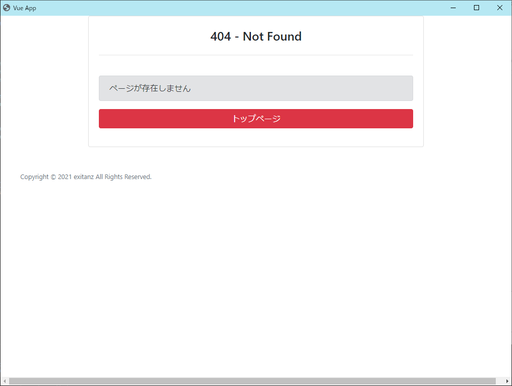
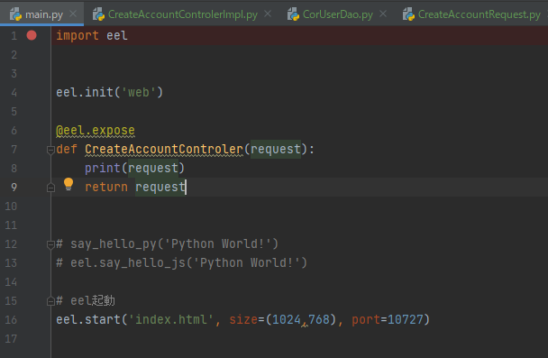

# Eel開発について

- vue開発
```
[Gitパス]\ゼミ用\05製造\eeldev\eelVue\graph
```

- eel開発
```
[Gitパス]\ゼミ用\05製造\eeldev\eelPy
```

# 実行の確認手順

### vue修正した場合
1. `npm run build` コマンドでビルド資材を `dist` ディレクトリに作成
2. `dist` 内の資材を `[Gitパス]\ゼミ用\05製造\eeldev\eelPy\web` 直下に置く
    - この時、既に存在する資材は削除すること
3. `[Gitパス]\ゼミ用\05製造\eeldev\eelPy\web` に置いた `index.html` をエディタで開く
4. 以下の箇所に `<script type="text/javascript" src="/eel.js"></script>` を追加する



5. `[Gitパス]\ゼミ用\05製造\eeldev\eelPy` でPycharmを起動する
6. `main.py` を開き、右クリックから `実行` を選択する



7. eelの起動が確認できれば成功



# 命名規約

### eelPy/api



- Controler系
    - 「～Controler」については `eelPy/main.py` 内にPHPのファイル名と同様のメソッドを作る
    - 「～Controler」の処理については `eelPy/controler/～ControlerImpl.py` で行う
- Request系
    - 「～Request」については `eelPy/request/～Request.py` で処理を行う
- Service系
    - 「～Service」については  `eelPy/service/～Service.py` で処理を行う
- Dao系
    - 「～Dao」については `eelPy/dao/～Dao.py` で処理を行う
    - 「～Dao」については `ConnectionManager.py` を使用してDB接続を行う
